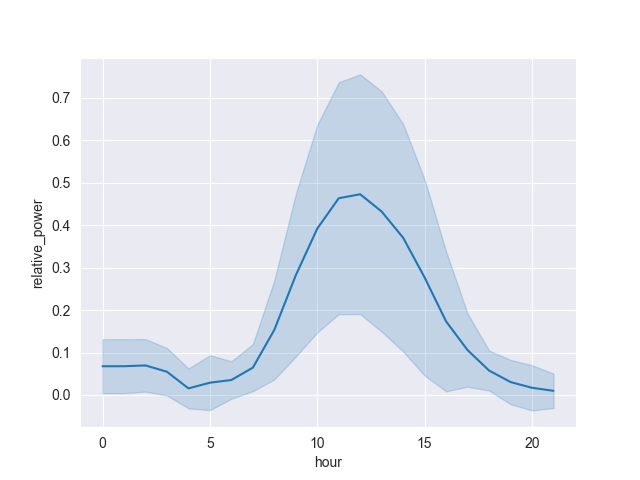
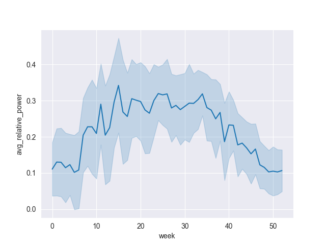

# DataHack @ Odiasay: Solar Energy Forecast
Forked from [mriganv/Machine-Learning-Model-for-Solar-Energy-Forecast](https://github.com/mriganv/Machine-Learning-Model-for-Solar-Energy-Forecast)

## About

This is a data science project about developing a machine learning regression model to accurately predict the rate of solar output measured as a % of baseline of capacity.
The project was presented during April 2025 [DataHack](https://datahack.org.il/) @ [Odiasay](https://www.madaney.net/odyssey) hackaton.

## Data Collection

The model is trained using real data obtained from three sources 
* A dataset which measures the rate of solar output measured as a % of baseline of capacity between 2014 and 2018, collected from real-life example. 
* Weather dataset from an API call to www.worldweatheronline.com for Hanover, Massachusetts location between  2014 and 2018. 
* Solar Irradiance datasets from www.nsrdb.nrel.gov between 2014 and 2018, which includes data on solar and weather values for variables such as Global Horizontal Irradiance (GHI), Direct Horizontal Irradiance (DHI), Direct Normal Irradiance (DNI), Wind Speed, Temperature and Solar Zenith Angle downloaded from the NSRDB. 

## Relative Power Distribution
Relative power average and standard deviation for each hour of the day in the dataset.

Average weekly relative power distribution.

